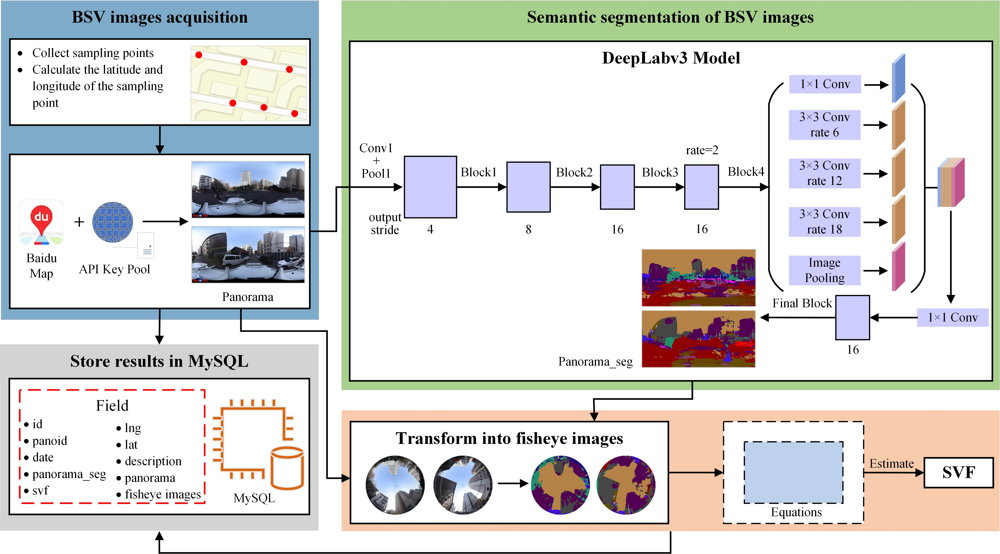

# BMapSVF

**The operation of this project requires the Server support of [BMapSVF Server](https://github.com/Voyagerlemon/BMapSVF-server)**




# Feature
- The technical architecture of micro front end is adopted.
- Conform to the normative organizational structure.
- Provides the configuration of common tools.
- Configuration file reading.
- axios
- rem
- iView
- SVG icon
- yarn commit
- IE 11
# Directory organization specification

```shell
├── public
│ ├── favicon.ico
│ ├── index.html
│ └── static ---------------------------- Place related hjson files uniformly
├── src
│ ├── App.vue --------------------------- Root component
│ ├── api ------------------------------- Interface management
│ ├── assets ---------------------------- Static file, usually used to store pictures
│ ├── components ------------------------ Global component
│ │ ├── FuncPanel ---------------------------- Global functional component
│ ├── svg ------------------------------  SVG icon
│ ├── initAppConfig.js --------------------- Example Initialize system configuration -------------------------------------------- information
│ ├── layout ---------------------------- layout Layer Management
│ ├── main.js --------------------------- app entry file
│ ├── router ---------------------------  Route
│ ├── store ----------------------------  Vuex
│ ├── styles ---------------------------- Global css and scss function variables
│ ├── utils ----------------------------- Tool function management
│ ├── views ----------------------------- Subsystem page module
│ └── widgets ---------------------------- Global widgets component
├── vite.config.js
├── .cz-config.js
├── .commitlintrc.js
├── .prettierrc
├── package.json
├── package-lock.json
├── postcss.config.js
├── tailwind.config.js
├── README.md
├── yarn.lock
```

# Install

### 1、Create environment

```shell
Install Node.js: https://nodejs.org/en
Install Yarn:    npm install --global yarn
```

### 2、 Install package

```shell
git clone https://github.com/Voyagerlemon/BMapSVF.git
cd BMapSVF
yarn or yarn install
```

### 3、 Run

```shell
yarn dev
```


# Notes

### Code submission specification

**`yarn commit`**

- feat: new features, new capabilities
- fix: fix bug
- merge: 
- perf: performance optimization
- refactor: code refactoring
- docs: document modification
- style: code format changes, not css changes
- chore: other changes, such as build processes, dependency management
- test: 
- version: 
- scope: commit impact range, such as route, component, utils, build...


### Installation and configuration instructions
#### SVG icon processing
- `yarn add vite-plugin-svg-icons` --- work with svg icons in the vite build tool
- `yarn add fast-glob` --- fast file traversal and cache processing after parsing
- Configure the relevant svg icons in vite.config.js
```javascript
import { defineConfig } from "vite";
import vue from "@vitejs/plugin-vue";
import { createSvgIconsPlugin } from "vite-plugin-svg-icons";
import { resolve } from "path";

// https://vitejs.dev/config/
export default defineConfig({
  plugins: [
    vue(),
    createSvgIconsPlugin({
      // Parse the svg icon address
      iconDirs: [resolve(process.cwd(), "src/svg")],
      // Parse svg icon names
      symbolId: "icon-[name]",
    }),
  ],
});
```

- Encapsulate svg icon components

```vue
<template>
  <svg :class="className" aria-hidden="true">
    <use :href="'#icon-' + iconName"></use>
  </svg>
</template>

<script setup>
const props = defineProps({
  // svg icon file name
  iconName: String,
  className: {
    type: String,
    default: () => "svg-icon",
  },
});
</script>

<style scoped>
.svg-icon {
  width: 3em;
  height: 3em;
  vertical-align: -0.15em;
  fill: currentColor;
  overflow: hidden;
}
</style>
```

- Global registration of svg icon components

```javascript
import SvgIcon from "./views/SvgViewer/components";
// Register SVG icon
import "virtual:svg-icons-register";
app.component("SvgIcon", SvgIcon);
```

- Globally registered svg icon components used by svg icon components

```vue
// The className class name allows you to adjust the style attribute of the svg icon as needed
<SvgIcon className="map-icon" iconName="404" />
.map-icon {
  width: 200px;
  height: 200px;
}
```

#### Route installation
- `yarn add vue-router -S`
#### View UI Plus
- `npm install view-ui-plus --save`
#### clipboard
- `yarn add clipboard -S` --- Used to copy text to the clipboard (temporarily deprecated in the project)
#### alias
- `yarn add -D @rollup/plugin-alias`
- `yarn add / npm install --save-dev @babel/plugin-proposal-optional-chaining`-->Optional chain operator? The attribute before the operator is valid or not
#### postcss-pxtorem
- `yarn add postcss-pxtorem -D`--- px ---> rem
#### Tailwind CSS
- `yarn add tailwindcss@2.2.16 postcss@latest autoprefixer@latest -D`---https://www.tailwindcss.cn/docs/installation
#### eslint and prettier
- `yarn add  eslint eslint-config-prettier eslint-plugin-prettier eslint-plugin-vue eslint-plugin-html prettier -D`
#### Pinia- Vue's own status management library (this project uses Vuex, Pinia as the next version update)
- `yarn add vuex -S`
- `yarn add vuex-persistedstate -S` --- Solve the problem that refreshed data is not saved
- `yarn add pinia` ---https://pinia.vuejs.org/zh/getting-started.html
- `yarn add pinia-plugin-persist -S` ---Realize data persistence function
#### yarn commit
https://yarnpkg.com/package/commitizen
- `yarn add commitizen -D`--- When commitizen is partially installed, fill in the submission information
- `yarn add cz-conventional-changelog -D` --- Adapters based on the conventional-changelog specification
- `yarn add cz-customizable -D` --- Support for custom adapters
- `yarn add @@commitlint/cli @commitlint/config-conventional husky lint-staged`
#### axios
- `yarn add axios -S`

# Citation

```text
@misc{BMapSVF,
  title={BMapSVF},
  url={https://github.com/Voyagerlemon/BMapSVF},
  note={Open source software available from https://github.com/Voyagerlemon/BMapSVF},
  author={Voyagerlemon},
  year={2023},
}
```

